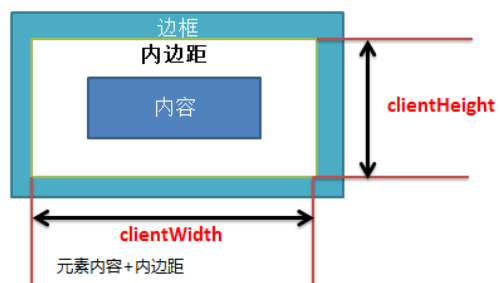
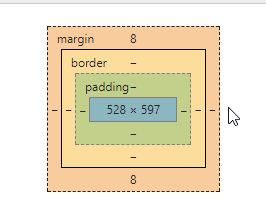
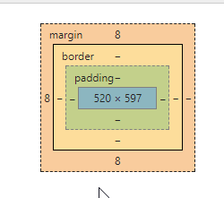
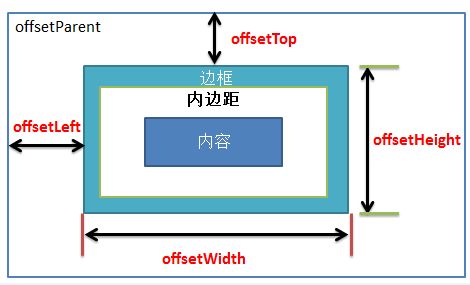

# jQueryCore-

##  遍历接口可以分为以下几大类
1. 遍历祖先(遍历父节点,遍历祖先节点,遍历曾祖先节点)
2. 遍历同胞兄弟(遍历拥有相同父元素的节点)
3. 遍历后代节点(子节点,孙子节点,曾孙子节点)
4. 过滤

## jQuery抽象出了dir方法,用来处理根据出入的元素,查找指定的元素
1. dir(当前元素,元素的层级关系(父元素,祖父元素等),元素的查找条件)


```
//遍历祖先元素
 function dir(elem,name,condition){
    //matched用来存储匹配到的节点
    var matched = [];
    //判断是否传入查找条件
    var isCondition = condition !== undefined;

    //开始查找所有符合条件的节点，直到当前节点为根节点结束查找
    while( ( elem = elem[name] ) && elem.nodeType !== 9){
        //是节点元素才加入到匹配项
        if(elem.nodeType == 1){

            if(isCondition){
                //判断当前节点是否符合传入条件。或者当前节点类名符合传入条件
                if(elem.nodeName.toLowerCase() == isCondition || elem.className == isCondition){
                    break;
                }

            }

            matched.push(elem)
        }
    }
    return matched
 }

```
```
//遍历同胞元素
function dir(elem, dir, until) {
  var matched = [],
    truncate = until !== undefined;
  while ((elem = elem[dir]) && elem.nodeType !== 9) {
    if (elem.nodeType === 1) {
      if (truncate) {
        if (elem.nodeName.toLowerCase() == until || elem.className == until) {
          break;
        }
      }
      matched.push(elem);
    }
  }
  return matched;
}

```
```
//遍历后代元素
  function sibling(n, elem) {
    var matched = [];
    for (; n; n = n.nextSibling) { //如果存在下一个兄弟节点
      if (n.nodeType === 1 && n !== elem) { //是元素节点，且不是当前选择器元素
        matched.push(n);
      }
    }
    return matched;
  }
```

## 元素大小

> 元素内尺寸的大小: clientWidth、clientHeight

1.clientWidth/clientHeight: 用于描述元素的内尺寸：元素内容 + 两边内边距。



```
clientWidth = width+padding（left、right）
clientHeight = height+padding（top、bottom）

```

> 网页可见区域宽document.body.clientWidth,'网页可见区域高document.body.clientHeight

1.可见区域的宽body默认的margin的值不会影响可视区的值

2.没有margin-left时



3.设置margin-left后




```
'网页可见区域宽clientWidth：' + document.body.clientWidth
'网页可见区域高clientHeight：' + document.body.clientHeight
```

> 偏移量 offset

1. 元素的可见大小由宽度高度决定，其中还要包括内边距、滚动条、边宽大小（不包括外边距）


